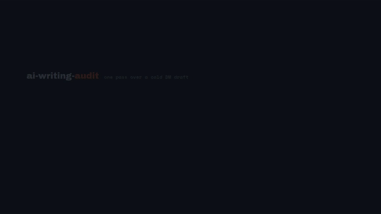

# ai-writing-audit

A skill for auditing and repairing text that reads as machine written. One skill, every
format: a two line direct message, an automated message sequence, an objection reply, a
caption, a carousel slide, a spoken script, a landing page, an essay, an email. Formats it
has never heard of are handled by deriving a profile for them, which is the section below on
adapting it to your own work.

## What makes it different from a word list

Most tools in this space are a list of banned words plus a dash ban. That catches an
unedited first draft and nothing else, because those signatures are the part that gets
removed by the next model release or by a single editing pass.

This skill runs two layers.

The **surface layer** is the word, punctuation, and formatting catalogue, built from
Wikipedia's "Signs of AI writing" field guide.

The **discourse layer** asks structural questions instead: does the text explain its own
point, does everything pull one way, does it resolve by asking the reader to decide, is
anything named. It comes from StoryScope (COLM 2026), which measured 61,608 stories and
separated human from machine text at 93.2 macro-F1 using narrative structure alone, with
no style signals at all. That paper also tested what happens when you clean the surface:
running a rewriter over cliche, redundant exposition, and purple prose moved its detection
by 1.6 points. The structure survived the polish.

Both layers run behind a **false positive gate**, because the sources spend a large part of
their text warning against over-reading, and a tool that finds seven problems in every text
is not a detector.

## What it will not tell you

Whether a machine wrote it. That question has a bad evidence base: one 2025 study puts human
accuracy at chance level, another at 57 percent, and a 2025 preprint puts heavy model users
at about 90 percent, which is one false accusation in every ten. Detector tools are recorded
in the same source as having non-trivial error rates and as breaking under paraphrase.

So the output is a reading verdict, not an authorship verdict, and the skill says so on
every run.

## Watch it work

A client direct message, audited and rewritten. 26 seconds.



## An example run

Input, 57 words:

> Hey Marcus! Hope you're doing well. I've been following your gym content for a while and
> I have to say, your commitment to helping people transform their lives is truly
> inspiring. I work with fitness coaches to streamline their client onboarding and unlock
> more consistent revenue. Would you be open to a quick chat this week to explore some
> ideas?

Verdict: reads machine, seven weighted findings, and the gate held back three things that
look like tells and are not. Repair:

> Marcus, your intake form asks for goals before it asks for a phone number, so people
> bounce at question four. I moved that question to the end for two coaches this spring and
> both stopped losing the form. Want the two lines I changed?

What moved: the compliment is replaced by something only Marcus's page could have prompted,
the claim carries a number and a timeframe, and the ask is smaller than the sale. Thirteen
more runs, including three human-written controls that must come back clean, are in
`TESTS.md`.

## Install

```
git clone https://github.com/thebgtagency/ai-writing-audit ~/.claude/skills/ai-writing-audit
```

Or copy the folder into your skills directory. Works with any AI assistant, not only
Claude: the skill is plain markdown, so you can also hand `SKILL.md` and the `references/`
folder to any model or agent as its instructions. Then ask for an audit on a draft. The
skill is for text that already exists. It is not for writing a first draft, and
`references/conflicts.md` item 14 explains why composing against a tell list makes text
worse rather than better.

## Adapting it to your own formats

Hand `SKILL.md` and `references/` to any assistant and tell it what you actually write:

> Adapt this skill for our support replies. Run "Adapting to a new format" in SKILL.md, ask
> me the six questions, and print the silence map.

What happens then is bounded on purpose. A format does not get its own rules. It gets its
own answer to which of the fixed rules can fire in it, and why the rest cannot.

**Fixed, and a derived profile cannot touch any of it:** the ten discourse checks, the
surface catalogue and its weights, the four gate questions, the density bands, the seven
themes and the bar for a verdict.

**Adapted:** the length band, which layers run, which catalogue entries are hard flags in
your format, which patterns are native to it, the pass bar, and the silence map.

The six questions each change exactly one check. Is the default grammatical person third.
Did the reader ask for this text. Is the structure itself the product. Could the writer have
known anything specific here. Is any feeling in scope. Is the order fixed by convention.
An answer that is not in your description is asked for, not guessed.

Two guards stop an assistant from improvising a profile that merely looks derived. Every
hard flag has to name its source in the fixed catalogue, so a profile cannot introduce a
tell by asserting one. And every derived profile prints a silence map covering all ten
checks, so a check that cannot fire in your format is reported rather than quietly dropped.
A silent check with no stated reason is inadmissible.

`references/conflicts.md` item 17 records the tension this resolves and what it costs.

## Files

```
SKILL.md                      the audit loop, the modes, the output contract
references/surface-tells.md   word, punctuation, and formatting catalogue
references/discourse-tells.md the structural layer, with the measured rates
references/false-positives.md what not to flag, and confidence by format
references/formats.md         profiles for ten formats, plus how to derive more
references/conflicts.md       seventeen disagreements between the sources, and the rulings
TESTS.md                      sixteen runs across ten formats, including three controls
```

## What it has actually been tested on

Ten formats have a recorded run in `TESTS.md`: direct message, automated sequence,
objection reply, caption, carousel, spoken script, long page, email, support reply, product
description. The last two are derived profiles, built by the procedure below rather than
written by hand, which is how the procedure is tested rather than only described.

Three controls, human-written, come back with zero findings. Two of them are rough. The
third is tidy and carries three machine-leaning values on purpose, because a tool that only
clears messy writing has learned the wrong lesson.

Formats without a recorded run are covered by the four-question derivation procedure at the
end of `references/formats.md`, and the skill does not claim measured coverage of them.

## Honest limits

Neither source measured the formats most text actually takes. The Wikipedia guide was built
on encyclopedia articles and says outright that some of its signs may not apply outside that
context. The fiction study was built on roughly 5,000 word stories and says that shorter
texts cannot support its features. Everything between those two, meaning messages, captions,
slides, ads, emails, and scripts, is covered here by argued transfer. Each transfer states
the reasoning that carries it so the reasoning can be checked rather than trusted, and the
parts that do not transfer are listed as fiction-only and are not applied.

The vocabulary lists are English. They do not survive translation, and the skill reports the
vocabulary layer as not run on text in another language rather than translating the list.

Every word list here ages. Human writing and speech are measurably drifting toward model
output, with a 2024 study finding significant influence in conversational podcasts. The
structural layer ages more slowly, which is the argument for keeping it even though it is
the harder pass to run.

## Sources

- Wikipedia, "Signs of AI writing", maintained by WikiProject AI Cleanup. CC BY-SA 4.0.
- Russell, Rajendhran, Pham, Iyyer, Wieting. "StoryScope: Investigating idiosyncrasies in AI
  fiction." COLM 2026.

## Licence

CC BY-SA 4.0. The skill incorporates and adapts material from a CC BY-SA 4.0 source, so the
same terms carry through. See `LICENSE`.
